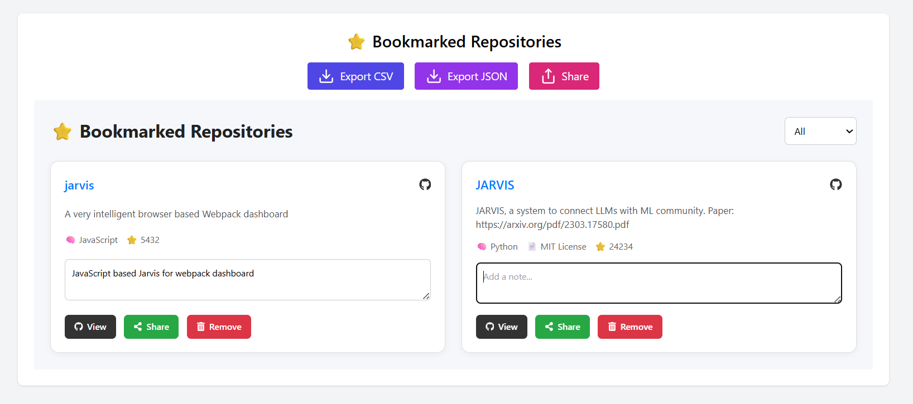
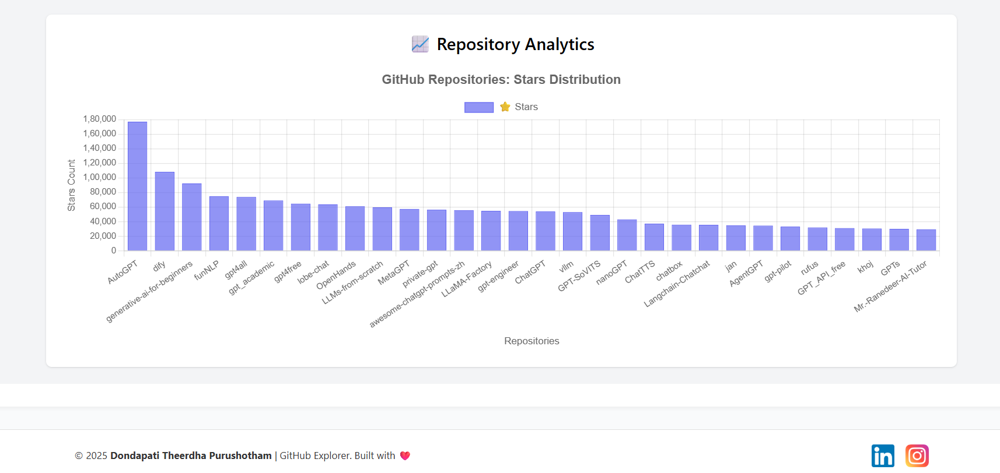

# 🚀 GitHub Project Explorer

A modern React-based dashboard to **explore, analyze, bookmark, and manage** popular repositories from GitHub. Built with features like search, filter, sort, export, and share functionalities, this app provides a smooth and insightful GitHub experience.

## 📌 Features

- 🔍 Search GitHub repositories by keyword
- 🏷️ Filter by programming language
- ⭐ Sort by stars, forks, or update time
- 📌 Bookmark repositories with personal notes
- 📊 Visualize repository star analytics using Bar Charts
- 📤 Export bookmarks as CSV or JSON
- 📎 Share bookmarked links to clipboard
- 🔁 Refresh and reset functionality
- 📱 Fully responsive and clean UI

## 💻 Tech Stack

- **React.js** (Frontend library)
- **Axios** (API calls to GitHub)
- **Chart.js + react-chartjs-2** (Analytics graph)
- **Lucide-react** (Modern icons)
- **React Icons** (Bookmark and social actions)
- **CSS / Tailwind-like classes** (custom styling in components)

## 📂 Folder Structure

src/
├── App.js
├── App.css
├── index.js
├── index.css
├── components/
│ ├── GitHubFetcher.jsx
│ ├── RepositoryCard.jsx
│ ├── BookmarkList.jsx
│ ├── RepoAnalyticsGraph.jsx
│ ├── Loader.jsx
│ └── Footer.jsx
├── utils/
│ └── api.js

## 🛠️ Installation and Setup

### Prerequisites

- Node.js (v14+)
- npm or yarn
- Internet connection (for fetching GitHub data)

### Commands Used:

# Step 1: Install dependencies
npm install

# Step 2: Start the development server
npm start

# Step 3 (Optional): If errors persist
rd /s /q node_modules
del package-lock.json
npm install
🌐 GitHub API Info
Endpoint Used: https://api.github.com/search/repositories

Params used:

q=stars:>1000 (basic popularity filter)

language, sort, order, page, per_page

📸 Screenshots
🎯 Dashboard
Displays top GitHub repositories with filter, sort, and search capabilities.

⭐ Bookmarked Repositories
Easily manage your favorite repositories with notes and tags.

📊 Repo Analytics
A bar graph that visualizes the star distribution of fetched repositories.

🔗 Links
GitHub API Docs

React

Chart.js

Lucide Icons

Developer LinkedIn: http://www.linkedin.com/in/dondapati-theerdha-purushotham

Instagram: https://www.instagram.com/velociraptor_alert_bulwark9

📃 License
MIT License – Free to use, modify, and distribute.

🙋‍♂️ Author
Dondapati Theerdha Purushotham
🚀 Built with passion and curiosity to make GitHub insights accessible and interactive.
